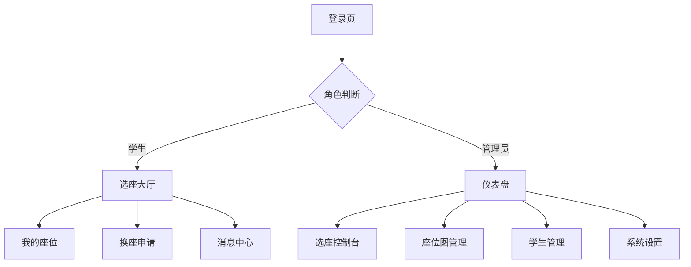

## 1. 产品概述
班级德育学分座次选择系统是一个基于德育学分排名的智能选座平台，支持学生按优先级在线选择座位，管理员可全程管控选座流程。
系统解决传统手动排座的效率问题，通过公平的学分排序机制实现透明化选座，适用于中小学班级管理场景。

## 2. 核心特性

### 2.1 用户角色
| 角色 | 注册方式 | 核心权限 |
|------|----------|----------|
| 学生 | 管理员创建账号 | 在线选座、查看座位、申请换座、提交特殊需求 |
| 管理员 | 系统预设账号 | 全功能管理，包括流程控制、座位编排、用户管理等 |

### 2.2 功能模块
本系统包含以下核心页面：
1. **登录页**：账号密码输入、身份验证、token存储
2. **学生端-选座大厅**：轮次信息展示、座位图渲染、选座交互
3. **学生端-我的座位**：当前座位查看、历史选座记录
4. **学生端-换座申请**：发起换座、申请状态跟踪
5. **学生端-消息中心**：系统通知查看
6. **管理员端-仪表盘**：选座数据统计、轮次状态监控
7. **管理员端-选座控制台**：流程控制、队列管理（核心功能）
8. **管理员端-座位图管理**：教室布局编辑、座位属性配置
9. **管理员端-学生管理**：学生信息CRUD、密码重置
10. **管理员端-系统设置**：全局参数配置、功能开关

### 2.3 页面详情
| 页面名称 | 模块名称 | 功能描述 |
|----------|----------|----------|
| 登录页 | 身份验证 | 输入账号密码提交登录，验证成功存储JWT token，根据角色跳转对应首页 |
| 学生端-选座大厅 | 状态展示 | 显示当前轮次名称、网站开放状态，顶部提示当前选座人和用户排队位置 |
| 学生端-选座大厅 | 座位图渲染 | 网格布局展示教室座位，绿色标记可用、红色标记已选、灰色标记锁定 |
| 学生端-选座大厅 | 选座交互 | 当own_turn为true时允许点击可用座位，弹出确认框；非自己时段显示"等待老师通知" |
| 学生端-我的座位 | 当前座位 | 显示已分配的座位位置、所在教室、同座同学信息 |
| 学生端-我的座位 | 历史记录 | 分页展示历史选座记录，包含时间、座位编号、学分排名 |
| 学生端-换座申请 | 申请发起 | 选择目标同学和座位，填写换座原因提交申请 |
| 学生端-换座申请 | 状态跟踪 | 列表展示所有换座申请，标记状态：待对方同意/待审核/已批准/已驳回 |
| 学生端-消息中心 | 通知列表 | 展示系统通知历史，支持已读/未读标记，可删除过期通知 |
| 管理员端-仪表盘 | 数据统计 | 显示当前轮次已选/未选人数、剩余选座时间、整体进度百分比 |
| 管理员端-选座控制台 | 队列展示 | 列表渲染学分排名队列，当前选座学生高亮显示 |
| 管理员端-选座控制台 | 流程控制 | 提供开始/暂停选座、下一位、跳过当前按钮，所有操作需二次确认 |
| 管理员端-座位图管理 | 布局编辑 | 支持创建新教室布局，拖拽调整座位位置，锁定/解锁座位 |
| 管理员端-学生管理 | 信息管理 | 增删改查学生信息，支持批量导入，单个重置密码功能 |
| 管理员端-系统设置 | 参数配置 | 开关组队功能、设置每人每年换座次数、配置Webhook URL等 |

## 3. 核心流程

## 4. 用户界面设计
### 4.1 设计风格
- 主色调：蓝色系(#1677ff)作为主色，配合绿色(#52c41a)表示可用、红色(#ff4d4f)表示已选、灰色(#8c8c8c)表示锁定
- 按钮风格：Ant Design标准圆角按钮，重要操作按钮使用主色填充
- 字体：系统无衬线字体，标题16px、正文14px、辅助文字12px
- 布局：顶部导航栏+侧边栏的后台管理布局，学生端采用顶部导航+主内容区
- 图标：使用Ant Design官方图标库，保持风格统一

### 4.2 页面设计概述
| 页面名称 | 模块名称 | UI元素 |
|----------|----------|--------|
| 选座大厅 | 座位图网格 | 每行8个座位卡片，间距8px，鼠标悬停可用座位有放大效果，点击弹出Modal确认 |
| 选座控制台 | 队列列表 | 表格形式展示排名，当前行背景色设为#fff7e6高亮，操作按钮组靠右排列 |
| 座位图管理 | 拖拽画布 | 白色画布背景，可拖拽的座位元素，右侧属性面板修改座位属性 |

### 4.3 响应式设计
- 桌面端优先开发，适配1920*1080及以上分辨率
- iPad横屏自适应，侧边栏可折叠，表格列自动隐藏非核心字段
- 触控交互优化：按钮最小点击区域48*48px，支持移动端基础操作

### 4.4 性能要求
- 页面首屏加载时间<2s
- 座位图渲染帧率保持60fps
- 短轮询请求延迟<100ms
- 所有操作有loading状态，错误时Toast提示