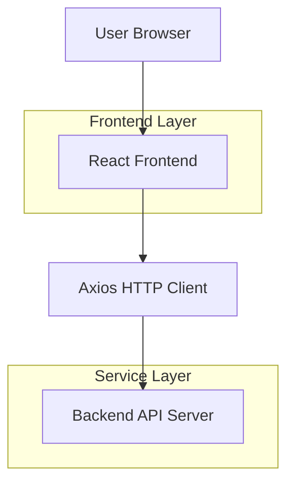
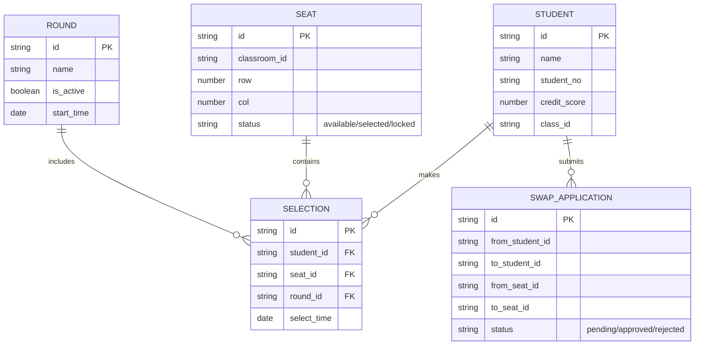

## 1. 架构设计


## 2. 技术栈说明
- 前端：React@18 + Ant Design@5 + React Router v6 + Zustand + Axios
- 初始化工具：Vite@5
- 状态管理：Zustand（全局状态）+ React Context（主题/权限）
- HTTP客户端：Axios（拦截器自动携带JWT token）
- 导出工具：xlsx（Excel导出功能）
- 拖拽库：react-dnd（座位图管理拖拽功能）

## 3. 路由定义
| 路由 | 角色权限 | 页面功能 |
|------|----------|----------|
| /login | 公开 | 登录页面，身份验证 |
| /student/hall | 学生 | 选座大厅，座位选择交互 |
| /student/seats | 学生 | 我的座位，历史记录查看 |
| /student/swap | 学生 | 换座申请，状态跟踪 |
| /student/messages | 学生 | 消息中心，通知列表 |
| /admin/dashboard | 管理员 | 数据仪表盘，统计信息 |
| /admin/console | 管理员 | 选座控制台，流程控制 |
| /admin/seats | 管理员 | 座位图管理，布局编辑 |
| /admin/students | 管理员 | 学生管理，CRUD操作 |
| /admin/settings | 管理员 | 系统设置，参数配置 |
| /admin/audit/swap | 管理员 | 换座审核，批准/驳回 |
| /admin/audit/special | 管理员 | 特殊需求审批 |

## 4. 前端状态设计
### 4.1 全局Store（Zustand）
```typescript
interface AppState {
  token: string | null
  user: { id: string; name: string; role: 'student'|'admin'; credit: number } | null
  setAuth: (token: string, user: AppState['user']) => void
  logout: () => void
}
```

### 4.2 Axios拦截器配置
所有请求自动在Header携带Authorization: Bearer {token}，401状态码自动跳转登录页。

## 5. 核心API对接
### 5.1 学生端轮询接口
```
GET /api/selection/status?round_id={roundId}
```
- 频率：每5秒短轮询
- 返回字段：is_open, current_selector, queue_position, own_turn

### 5.2 选座接口
```
POST /api/selection/choose
```
请求体：
```json
{
  "round_id": "string",
  "seat_id": "string",
  "student_id": "string"
}
```

### 5.3 管理员控制接口
```
POST /api/admin/selection/next
POST /api/admin/selection/skip
POST /api/admin/selection/pause
```

## 6. 数据模型设计
### 6.1 核心实体关系


## 7. 前端工程结构
```
src/
├── components/     # 通用组件
├── pages/          # 页面组件
│   ├── student/    # 学生端页面
│   └── admin/      # 管理员端页面
├── stores/         # Zustand状态管理
├── services/       # API请求封装
├── hooks/          # 自定义Hooks
├── utils/          # 工具函数
└── App.tsx         # 根组件
```

## 8. 部署说明
- 开发启动：npm run dev（默认端口5173）
- 生产构建：npm run build，输出dist目录
- 环境变量：VITE_API_BASE_URL配置后端API地址